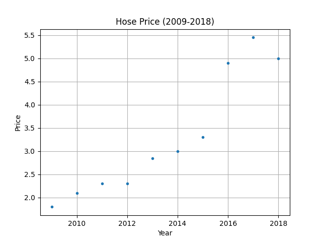
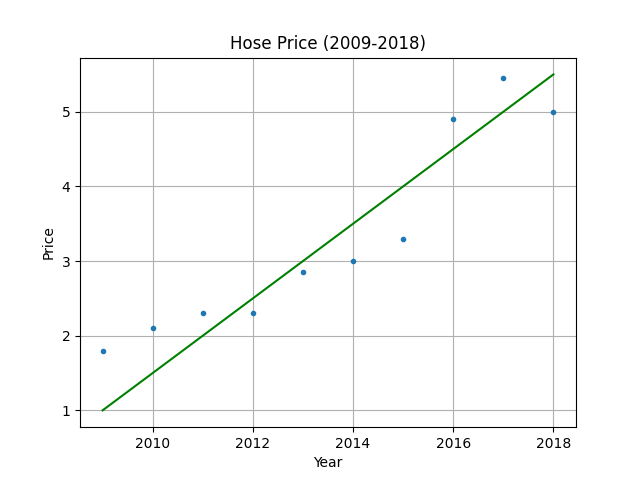

&emsp;
# Linear Regression
>回归（regression）
- 能为一个或多个自变量与因变量之间关系建模的一类方法。 在自然科学和社会科学领域，回归经常用来表示输入和输出之间的关系

>线性回归（linear regression）
- 可以追溯到19世纪初， 它在回归的各种标准工具中最简单而且最流行。 线性回归基于几个简单的假设： 
  - 假设自变量 $x$ 和因变量 $y$ 的关系是线性的，并且包含一些观测值的噪声
  - 假设任何噪声都比较正常，如噪声遵循正态分布

$$y = x\times w + b$$

下面将以房价预测的例子进行讲解

&emsp;
# 1 One-Dimension
假设影响房价的因素只有一个：年份，这里有一份数据，是 2010-2019 年的房价
```py
y_target = np.array([1.8, 2.1, 2.3, 2.3, 2.85, 3.0, 3.3, 4.9, 5.45, 5.0]) # 单位: 万元/平方
```

我们将数据可视化出来，并且希望能够找到一条直线，尽量的拟合这些数据：
$$y^{predict} = x\times w + b$$
其中 $w$ 和 $b$ 都是需要学习/优化（Optimize）的参数，我们初始可以随机给它们一个值

<table><tr>
    <td></td>
    <td></td>
</tr></table>

那我们就要开始去构造一个 Cost Function，使得每一个预测出来的值与实际值的差距的总和最小，然后利用梯度下降的思想不断的迭代更新 $w$ 和 $b$ 这两个参数，最终使得这条直线比较好的拟合数据：
$$Cost = \frac{1}{2}\sum(y^{predict} - y^{target})^2$$


&emsp;
# 2 Multi-Dimension
假设影响房价的因素有多个：室，厅，卫，总面积（平米），楼层，建成年份

那么一条输入的数据就变成了：室$x_1$，厅$x_2$，卫$x_3$，总面积（平米）$x_4$，楼层$x_5$，建成年份$x_6$
$$X = [x_1, x_2, x_3, x_4, x_5, x_6]$$
<div align=center>
    <image src='imgs/houseprice-bs1.png' width=600 />
</div>

分别对应的权重为：
$$W = [w_1, w_2, w_3, w_4, w_5, w_6]$$

我们重新进行建模，这个模型输入：室，厅，卫，总面积（平米），楼层，建成年份，就可以预测对应的房价，那么对应的线性方程变为：
$$y^{predict} = X @ W^T + b = [x_1, x_2, x_3, x_4, x_5, x_6] \begin{bmatrix}w_1\\w_2\\w_3\\w_4\\w_5\\w_6\end{bmatrix} + b$$

>batch size
- 就像 One-Dimension 需要多个年份的数据一样，我们需要多组数据来建模， 这时候就引入了一个概念：batch size
- 在 One-Dimension 的例子中，batch_size = 10（从 2010 到 2019 共 10 个年份的数据）

>矩阵求导
$$\begin{align}
    C = A @ B，G = \frac{\nabla Loss}{\nabla C}\\
\end{align}$$

$$\begin{align}
    \nabla A = G @ B^T \\
    \nabla B = A^T @ G
\end{align}$$


