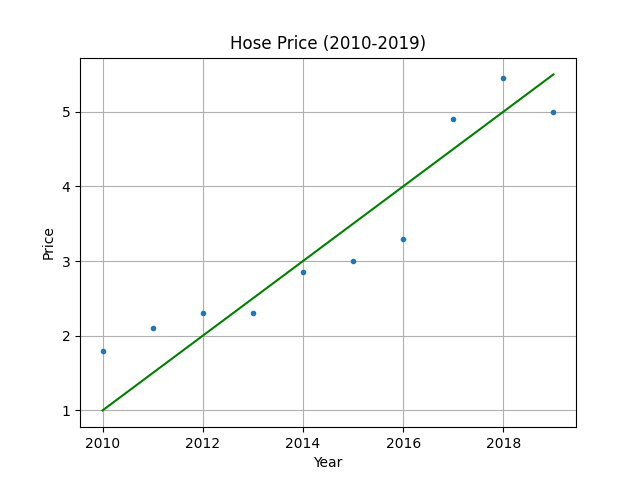

&emsp;
# Linear Regression
>回归（regression）
- 能为一个或多个自变量与因变量之间关系建模的一类方法。 在自然科学和社会科学领域，回归经常用来表示输入和输出之间的关系

>线性回归（linear regression）
- 可以追溯到19世纪初， 它在回归的各种标准工具中最简单而且最流行。 线性回归基于几个简单的假设： 
  - 假设自变量 $x$ 和因变量 $y$ 的关系是线性的，并且包含一些观测值的噪声
  - 假设任何噪声都比较正常，如噪声遵循正态分布

$$y = x\times w + b$$

下面将以房价预测的例子进行讲解

&emsp;
# 1 One-Dimension
假设影响房价的因素只有一个：年份，这里有一份数据，是 2010-2019 年的房价
```py
y_target = np.array([1.8, 2.1, 2.3, 2.3, 2.85, 3.0, 3.3, 4.9, 5.45, 5.0]) # 单位: 万元/平方
```

我们将数据可视化出来，并且希望能够找到一条直线，尽量的拟合这些数据：
$$y^{predict} = x\times w + b$$
其中 $w$ 和 $b$ 都是需要学习/优化（Optimize）的参数，我们初始可以随机给它们一个值

<table><tr>
    <td></td>
    <td></td>
</tr></table>

那我们就要开始去构造一个 Cost Function，使得每一个预测出来的值与实际值的差距的总和最小，然后利用梯度下降的思想不断的迭代更新 $w$ 和 $b$ 这两个参数，最终使得这条直线比较好的拟合数据：
$$Cost = \frac{1}{2}\sum(y^{predict} - y^{target})^2$$


&emsp;
# 2 Multi-Dimension
假设影响房价的因素有多个：室，厅，卫，总面积（平米），楼层，建成年份

那么一条输入的数据就变成了：室$x_1$，厅$x_2$，卫$x_3$，总面积（平米）$x_4$，楼层$x_5$，建成年份$x_6$
$$X = [x_1, x_2, x_3, x_4, x_5, x_6]$$
<div align=center>
    <image src='imgs/houseprice-bs1.png' width=600 />
</div>

分别对应的权重为：
$$W = [w_1, w_2, w_3, w_4, w_5, w_6]$$

我们重新进行建模，这个模型输入：室，厅，卫，总面积（平米），楼层，建成年份，就可以预测对应的房价，那么对应的线性方程变为：
$$y^{predict} = X @ W^T + b = [x_1, x_2, x_3, x_4, x_5, x_6] \begin{bmatrix}w_1\\w_2\\w_3\\w_4\\w_5\\w_6\end{bmatrix} + b$$

>batch size
- 就像 One-Dimension 需要多个年份的数据一样，我们需要多组数据来建模， 这时候就引入了一个概念：batch size
- 在 One-Dimension 的例子中，batch_size = 10（从 2010 到 2019 共 10 个年份的数据）

>矩阵求导
$$\begin{align}
    C = A @ B，G = \frac{\nabla Loss}{\nabla C}\\
\end{align}$$

$$\begin{align}
    \nabla A = G @ B^T \\
    \nabla B = A^T @ G
\end{align}$$


&emsp;
# 3 Batch Size


&emsp;
## 2.1 Batch Size = 1

- 假设数据是 1 张图片，将它输入网络，输出了 4 个值：

<div align=center>
    <image src='imgs/batchsize1.png' width=500/>
</div>

- 经过方程 $L = (X - Y)^2$ 后的结果为：
    $$L = [L_1，L_2，L_3，L_4]=\begin{bmatrix}
    (x_1 - y_{1})^2， (x_2 - y_{2})^2 ， (x_3 - y_{3})^2 ，(x_4 - y_{4})^2
    \end{bmatrix}$$

- 将他们加和并求均值：

    $$loss = (L_1 + L_2 + L_3 +L_4 )/4$$

- 要使得 loss 最小，问题转变成了 loss 对每个分量进行梯度下降了，也就是说我们要用这个公式
    $$x_{new} = x - lr*gradient$$
- 将每一个 $X$ 的分量更新到与 $Y$ 的每一个分量接近，其中的关键就是 $gradient$， 也就是要求出 $loss$ 对 $X$ 的导数: $\frac{d\ loss}{d\ X}$，用来批量更新 $x$
    $$X_{new} = X - lr*\frac{d\ loss}{d\ X}$$

- 求 $\frac{d\ loss}{d\ X}$

    $$\frac{d\ loss}{d\ X} = \frac{d\ loss}{d\ L}\frac{d\ L}{d\ X} =
    [\frac{\partial loss}{\partial L_1} \frac{\partial L_1}{\partial x_1}，
    \frac{\partial loss}{\partial L_2} \frac{\partial L_2}{\partial x_2}，
    \frac{\partial loss}{\partial L_3} \frac{\partial L_3}{\partial x_3}，
    \frac{\partial loss}{\partial L_4} \frac{\partial L_4}{\partial x_4}]
    $$

    $$= [\frac{1}{4} \times 2x_1，\frac{1}{4} \times 2x_2，\frac{1}{4} \times 2x_3，\frac{1}{4} \times 2x_4] $$
    $$= \frac{1}{2}X$$


&emsp;
## 3.2 Batch Size = n
- 假设数据是 $batch\ size=2$ 张图片，将它输入网络，输出了 4 个值：

<div align=center>
    <image src='imgs/batchsize2.png' width=600/>
</div>

- 经过方程 $L = (X - Y)^2$ 后的结果为：
    $$L = \begin{bmatrix}L_{11}，L_{12}，L_{13}，L_{14} \\
    L_{21}，L_{22}，L_{23}，L_{24}
    \end{bmatrix}$$
    $$=\begin{bmatrix}
    (x_{11} - y_{11})^2， (x_{12} - y_{12})^2 ， (x_{13} - y_{13})^2 ，(x_{14} - y_{14})^2 \\
    (x_{21} - y_{21})^2， (x_{22} - y_{22})^2 ， (x_{23} - y_{23})^2 ，(x_{24} - y_{24})^2
    \end{bmatrix}$$

- 将他们加和并求均值：

    $$loss = (L_{11} + L_{12} + L_{13} +L_{14} + L_{21} + L_{22} + L_{23} +L_{24} )/8$$

- 要使得 loss 最小，问题转变成了 loss 对每个分量进行梯度下降了，也就是说我们要用这个公式
    $$x_{new} = x - lr*gradient$$
- 将每一个 $X$ 的分量更新到与 $Y$ 的每一个分量接近，其中的关键就是 $gradient$， 也就是要求出 $loss$ 对 $X$ 的导数: $\frac{d\ loss}{d\ X}$，用来批量更新 $x$
    $$X_{new} = X - lr*\frac{d\ loss}{d\ X}$$

- 求 $\frac{d\ loss}{d\ X}$

    $$\frac{d\ loss}{d\ X} = \frac{d\ loss}{d\ L}\frac{d\ L}{d\ X} $$
    $$=\begin{bmatrix}
    \frac{\partial loss}{\partial L_{11}} \frac{\partial L_{11}}{\partial x_{11}}，
    \frac{\partial loss}{\partial L_{12}} \frac{\partial L_{12}}{\partial x_{12}}，
    \frac{\partial loss}{\partial L_{13}} \frac{\partial L_{13}}{\partial x_{13}}，
    \frac{\partial loss}{\partial L_{14}} \frac{\partial L_{14}}{\partial x_{14}} \\ \\
    \frac{\partial loss}{\partial L_{21}} \frac{\partial L_{21}}{\partial x_{21}}，
    \frac{\partial loss}{\partial L_{22}} \frac{\partial L_{22}}{\partial x_{22}}，
    \frac{\partial loss}{\partial L_{23}} \frac{\partial L_{23}}{\partial x_{23}}，
    \frac{\partial loss}{\partial L_{24}} \frac{\partial L_{24}}{\partial x_{24}}
    \end{bmatrix}$$

    $$= \begin{bmatrix}
    \frac{1}{8} \times 2x_{11}，\frac{1}{8} \times 2x_{12}，\frac{1}{8} \times 2x_{13}，\frac{1}{8} \times 2x_{14} \\ \\
    \frac{1}{8} \times 2x_{21}，\frac{1}{8} \times 2x_{22}，\frac{1}{8} \times 2x_{23}，\frac{1}{8} \times 2x_{24}
    \end{bmatrix}$$
    $$= \frac{1}{4}X$$

