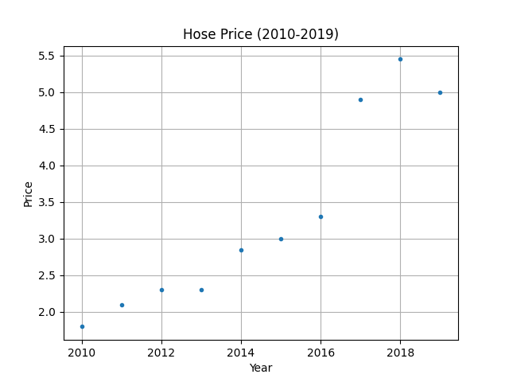

&emsp;
# Linear Regression
>回归（regression）
- 能为一个或多个自变量与因变量之间关系建模的一类方法。 在自然科学和社会科学领域，回归经常用来表示输入和输出之间的关系

>线性回归（linear regression）
- 可以追溯到19世纪初， 它在回归的各种标准工具中最简单而且最流行。 线性回归基于几个简单的假设： 
  - 假设自变量 $x$ 和因变量 $y$ 的关系是线性的，并且包含一些观测值的噪声
  - 假设任何噪声都比较正常，如噪声遵循正态分布

$$y = x\times w + b$$


&emsp;

下面将以房价预测的例子进行讲解

# 1 One-Dimension
假设影响房价的因素只有一个：年份，这里有一份数据，是 2010-2019 年的房价
```py
y_target = np.array([1.8, 2.1, 2.3, 2.3, 2.85, 3.0, 3.3, 4.9, 5.45, 5.0]) # 单位: 万元/平方
```

我们将数据可视化出来，并且希望能通过一个式子 $f(x) = y$ 来表达这些数据，$x$ 表示年份， $y$ 表示价格，在线性回归中采用的是下面这个式子：
$$y^{predict} = x\times w + b$$
- $w$: 权重。这个因素 $x$ 的权重，也就是说房价在什么程度上影响房价
- $b$: 噪声，误差。
- $w$ 和 $b$ 都是需要学习/优化（Optimize）的参数，我们初始可以随机给它们一个值

<table><tr>
    <td></td>
    <td></td>
</tr></table>

那我们就要开始去构造一个 Cost Function，使得每一个预测出来的值与实际值的差距的总和最小，然后利用梯度下降的思想不断的迭代更新 $w$ 和 $b$ 这两个参数，最终使得这条直线比较好的拟合数据：
$$Cost = \frac{1}{2}\sum(y^{predict} - y^{target})^2$$


&emsp;
# 2 Multi-Dimension
假设影响房价的因素有多个：室，厅，卫，总面积（平米），楼层，建成年份

那么一条输入的数据就变成了：室$x_1$，厅$x_2$，卫$x_3$，总面积（平米）$x_4$，楼层$x_5$，建成年份$x_6$
$$X = [x_1, x_2, x_3, x_4, x_5, x_6]$$
<div align=center>
    <image src='imgs/houseprice-bs1.png' width=600 />
</div>

分别对应的权重为：
$$W = [w_1, w_2, w_3, w_4, w_5, w_6]$$

我们重新进行建模，这个模型输入：室，厅，卫，总面积（平米），楼层，建成年份，就可以预测对应的房价，那么对应的线性方程变为：
$$y^{predict} = X @ W^T + b = [x_1, x_2, x_3, x_4, x_5, x_6] \begin{bmatrix}w_1\\w_2\\w_3\\w_4\\w_5\\w_6\end{bmatrix} + b$$

>batch size
- 就像 One-Dimension 需要多个年份的数据一样，我们需要多组数据来建模， 这时候就引入了一个概念：batch size
- 在 One-Dimension 的例子中，batch_size = 10（从 2010 到 2019 共 10 个年份的数据）

>矩阵求导
$$\begin{align}
    C = A @ B，G = \frac{\nabla Loss}{\nabla C}\\
\end{align}$$

$$\begin{align}
    \nabla A = G @ B^T \\
    \nabla B = A^T @ G
\end{align}$$


&emsp;
# 3 Boston House Price

## 3.1 Dataset
Each record in the database describes a Boston suburb or town. The data was drawn from the Boston Standard Metropolitan Statistical Area (SMSA) in 1970. The attributes are defined as follows (taken from the UCI Machine Learning Repository1): CRIM: per capita crime rate by town

Input features in order:
1) CRIM: per capita crime rate by town
2) ZN: proportion of residential land zoned for lots over 25,000 sq.ft.
3) INDUS: proportion of non-retail business acres per town
4) CHAS: Charles River dummy variable (1 if tract bounds river; 0 otherwise)
5) NOX: nitric oxides concentration (parts per 10 million) [parts/10M]
6) RM: average number of rooms per dwelling
7) AGE: proportion of owner-occupied units built prior to 1940
8) DIS: weighted distances to five Boston employment centres
9) RAD: index of accessibility to radial highways
10) TAX: full-value property-tax rate per $10,000 [$/10k]
11) PTRATIO: pupil-teacher ratio by town
12) B: The result of the equation $B=1000(Bk - 0.63)^2$ where Bk is the proportion of blacks by town
13) LSTAT: % lower status of the population

Output variable:
1) MEDV: Median value of owner-occupied homes in \$1000's [k$]
