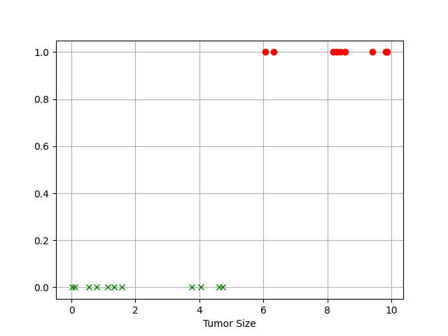
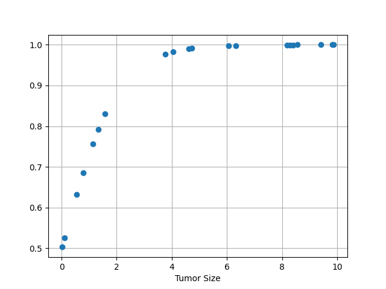

&emsp; 
# Logistic Regression 逻辑回归

>Logistic 回归的本质
- 人话版：线性回归 + sigmoid 函数
- 做作版：假设数据服从 Logistic 分布，然后使用极大似然估计做参数的估计。
>Notice
- 虽然逻辑回归名称带 "回归"，但它是用来解决分类问题的，也就是说它的输出是离散的

>sigmoid 函数
$$y = \frac{1}{1+e^{-x}}$$

    <image src='imgs/sigmoid.png'width=300>

&emsp;

以下使用肿瘤预测的例子给大家说明
# 1 One-Dimension
假设医生判断肿瘤恶性（malignant）和良性（benign）的依据只有一个：肿瘤大小，同样考虑这个因素的影响权重和一些数据噪声，则有：
$$y = x\times w + b$$

如果很简单粗暴的定一个标准：小于 5cm 为良性，大于 5cm 为恶性，考虑两个问题：
- 这样是不是不太合理或者说不严谨，如果能把它转换成概率的表达方式是不是会更加好一点？
- 根据这个条件写出来的函数是阶跃函数，这样的函数可以利用梯度下降来优化吗？
$$f(x) = \begin{cases}0，x<5 \\ 1，x\geq 5\end{cases}$$

解决这个问题很简单，将 $y = x\times w + b$ 的输出，接一个 sigmoid 函数，既转换成了概率值，又能够求导优化：
<table><tr>
    <td></td>
    <td></td>
</tr></table>

>Loss 函数

$$L = -\frac{1}{n}(
    \sum\limits^{n}_{i=1}\Bigg(
        y^{target}\cdot lny^{predict} + (1-y^{target})\cdot ln (1-y^{predict})
        \Bigg))$$

>Loss 函数导数
$$dL = \frac{1}{n}(y^{predict} - y^{target})$$

&emsp;
# 2 Muti-Dimension

&emsp;
# 3 Breast Cancer Wisconsin
## 3.1 Dataset
Breast Cancer Wisconsin (Diagnostic) Data Set Attribute Information:

- 1\) ID number 2) Diagnosis (M = malignant, B = benign)
- 3-32)Ten real-valued features are computed for each cell nucleus:
    - a) radius (mean of distances from center to points on the perimeter) 
    - b) texture (standard deviation of gray-scale values)
    - c) perimeter
    - d) area
    - e) smoothness (local variation in radius lengths)
    - f) compactness (perimeter^2 / area - 1.0)
    - g) concavity (severity of concave portions of the contour)
    - h) concave points (number of concave portions of the contour)
    - i) symmetry
    - j) fractal dimension ("coastline approximation" - 1)

The mean, standard error and "worst" or largest (mean of the three
largest values) of these features were computed for each image,
resulting in 30 features. For instance, field 3 is Mean Radius, field

13 is Radius SE, field 23 is Worst Radius.

All feature values are recoded with four significant digits.

Missing attribute values: none

Class distribution: 357 benign, 212 malignant

